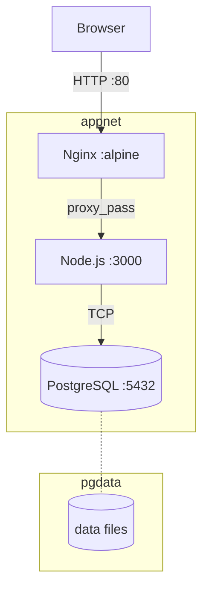

# Dockerized Web Application

Multi-container stack with Nginx, Node.js, and PostgreSQL — orchestrated by Docker Compose with health checks, isolated networking, and persistent storage.

## Overview

This repository runs a complete web application locally with one command: `docker compose up -d`. Nginx terminates HTTP on port 80 and proxies to a Node.js app on port 3000, which connects to PostgreSQL on an isolated bridge network. Data persists in a named volume, and health checks gate readiness.

**Real-world problem it solves:** eliminate “works on my machine” by codifying runtime, dependencies, and topology — so the same artifact builds once and runs identically on any host.

```
User --:80--> Nginx --:3000--> Node.js --:5432--> PostgreSQL
                 \-- appnet (bridge) --/    +-- pgdata (volume)
```

## Architecture



Compose defines `depends_on: condition: service_healthy` so Nginx only starts after the app is healthy, and the app only starts after the DB is healthy. See `docs/architecture.md`.

## Technologies

| Technology | Purpose |
|---|---|
| Docker + Docker Compose | Build and orchestrate containers |
| Nginx (`nginx:alpine`) | Reverse proxy on port 80 |
| Node.js (`node:22-alpine`) | App runtime (zero npm dependencies) |
| PostgreSQL (`postgres:16-alpine`) | Relational database |
| Bash | Health checks, demo automation, tests |
| Make | Task shortcuts |

## Features

- Multi-stage Dockerfile (`builder` → `runtime`) producing a minimal non-root image with build-time syntax check
- Custom bridge network `appnet` with container-name DNS
- Named volume `pgdata` for durable DB storage
- Environment-driven config via `.env` (never committed)
- Health checks: `pg_isready` (DB) and `wget /health` (app); Compose `service_healthy` gating
- Security headers and `server_tokens off` in Nginx

## Prerequisites

- Docker Engine 24+ with Compose v2 (Docker Desktop on Windows/macOS)
- Git
- Bash (Git Bash/WSL/macOS/Linux)
- Node 18+ optional for local syntax checks

## Setup

```bash
git clone <this-repo> && cd dockerized-web-application
cp .env.example .env   # set a real DB_PASSWORD
docker compose build
docker compose up -d
docker compose ps      # expect Up (healthy) for db and app
```

Details: `docs/setup.md`.

## Configuration

All runtime config comes from `.env` (see `.env.example`):

| Variable | Default | Used by |
|---|---|---|
| `DB_USER` | `appuser` | `db` + `app` |
| `DB_PASSWORD` | `change-me` | `db` only (placeholder) |
| `DB_NAME` | `appdb` | `db` + `app` |
| `DB_HOST` | `db` | `app` (must match service name) |
| `DB_PORT` | `5432` | `app` + `db` |
| `PORT` | `3000` | `app` |

Nginx routing: `nginx/default.conf`; DB init/seed: `database/init/01-init.sql`.

## Deployment

```bash
make up            # docker compose up -d --build
make logs          # tail logs
make config        # validate compose file
```

Manual:

```bash
docker compose up -d --build
curl -s http://localhost/health        # {"status":"ok"}
curl -s http://localhost/              # HTML
curl -s http://localhost/api/message   # { message, db: { status } }
```

See `docs/deployment.md`.

## Testing

```bash
bash tests/test-api.sh   # requires stack up
```

Checks: `/health` 200 + `ok`, `/` 200, `/api/message` DB `connected`. Prints `PASS`/`FAIL`, exits non-zero on failure. Also:

```bash
bash scripts/healthcheck.sh       # uses $HEALTHCHECK_URL or http://localhost/health
bash scripts/demo.sh              # build → up → wait → probe → inspect → down
```

## Monitoring / Logging

- Logs: `docker compose logs -f --tail=100` (all), `docker compose logs app`
- Stats: `docker stats`
- Health: `docker compose ps`, `docker inspect app-node --format '{{json .State.Health}}'`
- Disk: `docker system df`

## Security

- `.env` gitignored; only `.env.example` with `change-me` committed
- App runs as non-root `node` user (`USER node`, `--chown=node:node`)
- Minimal image via multi-stage build (no compilers/package managers)
- DB port 5432 not published to host — internal network only
- See `docs/security.md` for scanning and secret management notes

## Cleanup

```bash
docker compose down        # keep pgdata
docker compose down -v     # delete pgdata volume
docker image rm dockerized-app:latest || true
```

## Project Structure

```
dockerized-web-application/
├── README.md
├── docker-compose.yml
├── .env.example
├── .dockerignore
├── .gitignore
├── Makefile
├── app/
│   ├── Dockerfile
│   ├── package.json
│   ├── server.js
│   └── src/routes.js
├── nginx/
│   └── default.conf
├── database/
│   └── init/01-init.sql
├── scripts/
│   ├── healthcheck.sh
│   └── demo.sh
├── tests/
│   └── test-api.sh
├── docs/
├── diagrams/
└── screenshots/
```

## Future Improvements

- Push images by git SHA to GHCR/Docker Hub and deploy pinned tags
- Replace `.env` with Docker secrets / Vault / SOPS
- TLS termination at Nginx (Let's Encrypt)
- DB migrations (Flyway) and `pgdata` backup automation
- Read-only rootfs and dropped capabilities for app container
